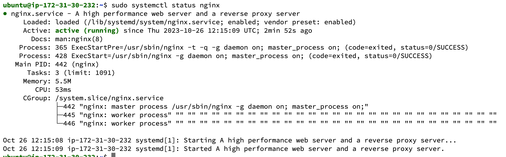

# Implementing Loadbalancers with NGINX

Loadbalancing is a concept where we learn how to distribute traffic effectively across multiple servers, optimize performance and ensure high availability for your hosted web applications

NGINX is an amazing software that can act as a Web server, Reverse Proxy, and Load Balancer 

## Setting up a Basic Loadbalancer

Create An EC2 instance on AWS, add `port 8000` to the inboud rule setting of the security group. Connect via SSH
This is because we will be running our webservers on port 8000 and our loadbalancer runs on port 80.

With `Termius` the process is a little easy when you know which security you are using, IP address and username is is mostly `ubuntu`


Let's install Apache on the new instance using 

```
sudo apt update -y &&  sudo apt install apache2 -y
```


verify that apache is working using 

```
sudo systemctl status apache2
```


## Configure Apache server to listen on port 8000 

Next step is to configure apache to listen on port 8000. It can now listen on both ports 80 and 8000

To do this, we need to edit the ports.conf file located in `/etc/apache2/ports.conf` file. 

```
sudo nano /etc/apache2/ports.conf
```


One more file to edit is the `000-default.conf` file which is also responsible for hosting each personal site, (Virtual Host) using the command and change the port to 8000 as shown below

```
sudo nano /etc/apache2/sites-available/000-default.conf
```


Restart the apache server using

```
sudo systemctl restart apache2
```

### Create an index.html file to be used 

```
nano index.html
```

Paste the code below into the html file you just created.

        <!DOCTYPE html>
        <html>
        <head>
            <title>My EC2 Instance</title>
        </head>
        <body>
            <h1>Welcome to my EC2 instance</h1>
            <p>Public IP: YOUR_PUBLIC_IP</p>
        </body>
        </html>


We also need to change the ownership of the index.html file using

```
sudo chown www-data:www-data ./index.html
```


Lastly we need to override the default index.html file that came preinstalled with Apache, located in `/var/www/html/index.html`

Use the code below and restart the apache2 server

```
sudo cp -f index.html /var/www/html
```


## Configuring Nginx as a Load balancer

Provision a new EC2 instance with port 80 open to all incoming traffic.

After the install Nginx using the command

```
sudo apt update -y && sudo apt install nginx -y
```

Verify `nginx` is installed with `which nginx`




Make a new configuration file loadbalancer.conf in the config direction of NginX and check if the configuration was successful using `sudo nginx -t`

```
sudo nano /etc/nginx/conf.d/loadbalancer.conf
```


```
sudo systemctl restart nginx
```

Restart the server and test.


VOILA!! It works